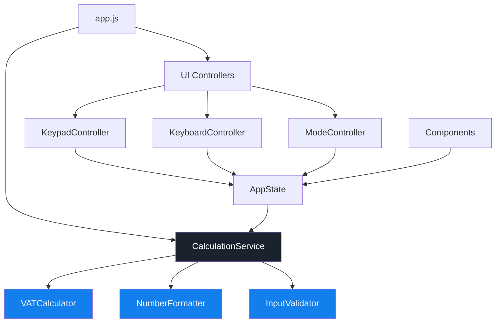

# VAT Calculator - Directory Structure

**설계 원칙**: TDD + SOLID + Clean Architecture  
**UI 프레임워크**: Google Stitch Design (Tailwind CSS)  
**테스트 프레임워크**: Jest (예정)

---

## 📁 전체 디렉토리 구조

```
VAT/
├── .github/
│   └── workflows/
│       └── deploy.yml              # GitHub Actions 배포 워크플로우
│
├── public/                          # 정적 파일 (배포용)
│   ├── index.html                  # 메인 HTML (UI만 포함, 로직 없음)
│   ├── favicon.ico
│   └── manifest.json               # PWA 매니페스트 (Phase 3)
│
├── src/                            # 소스 코드 (비즈니스 로직 + UI 컨트롤러)
│   ├── core/                       # 핵심 비즈니스 로직 (UI 독립적)
│   │   ├── calculator/             # 계산 엔진 (SRP: 계산만 담당)
│   │   │   ├── VATCalculator.js   # 부가세 계산 클래스
│   │   │   ├── CalculationMode.js # 계산 모드 enum/상수
│   │   │   └── index.js            # Public API 노출
│   │   │
│   │   ├── formatters/             # 데이터 포맷팅 (SRP: 포맷팅만 담당)
│   │   │   ├── NumberFormatter.js # 숫자 포맷팅 (천 단위 콤마)
│   │   │   └── index.js
│   │   │
│   │   └── validators/             # 입력 검증 (SRP: 검증만 담당)
│   │       ├── InputValidator.js   # 입력값 검증 로직
│   │       └── index.js
│   │
│   ├── services/                   # 애플리케이션 서비스 (비즈니스 로직 조율)
│   │   ├── CalculationService.js  # 계산 서비스 (계산기 + 포맷터 조합)
│   │   ├── ClipboardService.js    # 클립보드 복사 서비스
│   │   ├── StorageService.js      # LocalStorage 관리 (Phase 2)
│   │   └── index.js
│   │
│   ├── ui/                         # UI 레이어 (프레젠테이션 로직만)
│   │   ├── components/             # UI 컴포넌트 (SRP: 각 컴포넌트는 하나의 UI 요소만)
│   │   │   ├── Header.js          # 헤더 컴포넌트
│   │   │   ├── ModeToggle.js      # 모드 전환 컴포넌트
│   │   │   ├── InputDisplay.js    # 입력 금액 표시
│   │   │   ├── ResultCard.js      # 계산 결과 카드
│   │   │   ├── NumericKeypad.js   # 숫자 키패드
│   │   │   ├── Toast.js           # 토스트 알림
│   │   │   └── index.js
│   │   │
│   │   ├── controllers/            # UI 컨트롤러 (이벤트 핸들링)
│   │   │   ├── KeypadController.js     # 키패드 입력 제어
│   │   │   ├── KeyboardController.js   # 물리 키보드 제어
│   │   │   ├── ModeController.js       # 모드 전환 제어
│   │   │   └── index.js
│   │   │
│   │   └── state/                  # UI 상태 관리 (SRP: 상태 관리만)
│   │       ├── AppState.js        # 애플리케이션 전역 상태
│   │       ├── StateManager.js    # 상태 업데이트 및 구독 관리
│   │       └── index.js
│   │
│   ├── utils/                      # 유틸리티 함수 (공통 헬퍼)
│   │   ├── constants.js           # 상수 정의 (VAT_RATE, MAX_DIGITS 등)
│   │   ├── debounce.js            # 디바운스 유틸
│   │   └── index.js
│   │
│   ├── app.js                      # 애플리케이션 진입점 (의존성 주입 및 초기화)
│   └── index.js                    # 모듈 번들 엔트리 포인트
│
├── tests/                          # 테스트 코드 (src와 1:1 매핑)
│   ├── unit/                       # 단위 테스트
│   │   ├── core/
│   │   │   ├── calculator/
│   │   │   │   ├── VATCalculator.test.js      # ✅ TDD: 계산 로직 테스트
│   │   │   │   └── CalculationMode.test.js
│   │   │   ├── formatters/
│   │   │   │   └── NumberFormatter.test.js    # ✅ TDD: 포맷팅 테스트
│   │   │   └── validators/
│   │   │       └── InputValidator.test.js     # ✅ TDD: 검증 테스트
│   │   │
│   │   └── services/
│   │       ├── CalculationService.test.js     # ✅ TDD: 서비스 통합 테스트
│   │       ├── ClipboardService.test.js
│   │       └── StorageService.test.js
│   │
│   ├── integration/                # 통합 테스트
│   │   ├── calculator-flow.test.js            # 계산 플로우 전체 테스트
│   │   └── ui-interaction.test.js             # UI 인터랙션 테스트
│   │
│   └── e2e/                        # E2E 테스트 (선택사항)
│       └── app.test.js             # 전체 앱 시나리오 테스트
│
├── docs/                           # 문서
│   ├── PRD.md                      # 제품 요구사항 문서
│   ├── TECH_SPEC.md                # 기술 명세서
│   ├── DIRECTORY_STRUCTURE.md      # 본 문서
│   └── API.md                      # API 문서 (Phase 2)
│
├── .gitignore                      # Git 제외 파일
├── package.json                    # 프로젝트 메타데이터 및 의존성
├── jest.config.js                  # Jest 설정
├── README.md                       # 프로젝트 소개
└── tasks.md                        # 구현 태스크 체크리스트
```

---

## 🎯 SOLID 원칙 적용

### 1. Single Responsibility Principle (SRP)

각 모듈은 **하나의 책임**만 가집니다:

| 모듈 | 책임 | 변경 이유 |
|------|------|----------|
| `VATCalculator.js` | 부가세 계산 로직만 | 계산 공식 변경 |
| `NumberFormatter.js` | 숫자 포맷팅만 | 포맷 규칙 변경 |
| `InputValidator.js` | 입력 검증만 | 검증 규칙 변경 |
| `CalculationService.js` | 계산 + 포맷 조율 | 비즈니스 플로우 변경 |
| `KeypadController.js` | 키패드 이벤트 처리만 | 키패드 동작 변경 |
| `AppState.js` | 상태 저장만 | 상태 구조 변경 |

### 2. Open/Closed Principle (OCP)

확장에는 열려있고, 수정에는 닫혀있습니다:

```javascript
// ❌ 나쁜 예: 새 계산 모드 추가 시 기존 코드 수정 필요
function calculate(amount, mode) {
  if (mode === 'inclusive') { /* ... */ }
  else if (mode === 'exclusive') { /* ... */ }
  // 새 모드 추가 시 여기를 수정해야 함
}

// ✅ 좋은 예: 전략 패턴으로 확장 가능
class VATCalculator {
  constructor(strategy) {
    this.strategy = strategy;
  }
  
  calculate(amount) {
    return this.strategy.calculate(amount);
  }
}

// 새 모드는 새 클래스로 추가
class InclusiveStrategy { /* ... */ }
class ExclusiveStrategy { /* ... */ }
```

### 3. Liskov Substitution Principle (LSP)

서비스 인터페이스는 일관성을 유지합니다:

```javascript
// 모든 계산 전략은 동일한 인터페이스 구현
interface CalculationStrategy {
  calculate(amount: number): CalculationResult;
}
```

### 4. Interface Segregation Principle (ISP)

클라이언트는 사용하지 않는 메서드에 의존하지 않습니다:

```javascript
// ❌ 나쁜 예: 거대한 인터페이스
interface Calculator {
  calculate();
  format();
  validate();
  save();
  load();
}

// ✅ 좋은 예: 분리된 인터페이스
interface Calculator { calculate(); }
interface Formatter { format(); }
interface Validator { validate(); }
interface Storage { save(); load(); }
```

### 5. Dependency Inversion Principle (DIP)

고수준 모듈은 저수준 모듈에 의존하지 않고, 추상화에 의존합니다:

```javascript
// ✅ 의존성 주입 (app.js에서)
const calculator = new VATCalculator();
const formatter = new NumberFormatter();
const validator = new InputValidator();

// 서비스는 구체적인 구현이 아닌 인터페이스에 의존
const calculationService = new CalculationService(
  calculator,  // 주입
  formatter,   // 주입
  validator    // 주입
);
```

---

## 🧪 TDD 매핑 (src ↔ tests)

### 핵심 원칙
- **모든 비즈니스 로직은 테스트 우선 작성** (Red → Green → Refactor)
- **UI 컴포넌트는 수동 테스트** (브라우저 확인)
- **서비스 레이어는 통합 테스트**

### 매핑 테이블

| src 파일 | tests 파일 | 테스트 타입 | 우선순위 |
|----------|-----------|-----------|---------|
| `src/core/calculator/VATCalculator.js` | `tests/unit/core/calculator/VATCalculator.test.js` | 단위 | **P0** |
| `src/core/formatters/NumberFormatter.js` | `tests/unit/core/formatters/NumberFormatter.test.js` | 단위 | **P0** |
| `src/core/validators/InputValidator.js` | `tests/unit/core/validators/InputValidator.test.js` | 단위 | **P0** |
| `src/services/CalculationService.js` | `tests/unit/services/CalculationService.test.js` | 단위 | **P0** |
| `src/services/ClipboardService.js` | `tests/unit/services/ClipboardService.test.js` | 단위 | P1 |
| `src/services/StorageService.js` | `tests/unit/services/StorageService.test.js` | 단위 | P1 |
| `src/ui/components/*` | 수동 테스트 (브라우저) | 수동 | P0 |
| `src/ui/controllers/*` | `tests/integration/ui-interaction.test.js` | 통합 | P1 |
| `src/app.js` | `tests/integration/calculator-flow.test.js` | 통합 | P1 |

### TDD 워크플로우 예시

```bash
# 1. 테스트 작성 (Red)
tests/unit/core/calculator/VATCalculator.test.js

# 2. 구현 (Green)
src/core/calculator/VATCalculator.js

# 3. 리팩토링 (Refactor)
# 테스트 통과 유지하며 코드 개선

# 4. 다음 기능으로 반복
```

---

## 📦 모듈 의존성 그래프



**의존성 방향**: UI → Services → Core (단방향)

---

## 🔧 핵심 모듈 상세 설명

### 1. `src/core/calculator/VATCalculator.js`

**책임**: 부가세 계산 로직 (순수 함수)

```javascript
/**
 * VAT 계산 엔진
 * - UI와 완전히 독립적
 * - 테스트 가능한 순수 함수
 * - SRP: 계산만 담당
 */
export class VATCalculator {
  constructor(vatRate = 0.1) {
    this.vatRate = vatRate;
  }

  /**
   * 부가세 포함 금액에서 역산
   * @param {number} totalAmount
   * @returns {CalculationResult}
   */
  calculateInclusive(totalAmount) {
    const supplyAmount = Math.round(totalAmount / (1 + this.vatRate));
    const vatAmount = totalAmount - supplyAmount;
    
    return {
      supplyAmount,
      vatAmount,
      totalAmount,
      mode: 'inclusive'
    };
  }

  /**
   * 공급가액에서 부가세 계산
   * @param {number} supplyAmount
   * @returns {CalculationResult}
   */
  calculateExclusive(supplyAmount) {
    const vatAmount = Math.round(supplyAmount * this.vatRate);
    const totalAmount = supplyAmount + vatAmount;
    
    return {
      supplyAmount,
      vatAmount,
      totalAmount,
      mode: 'exclusive'
    };
  }
}
```

**테스트**: `tests/unit/core/calculator/VATCalculator.test.js`

---

### 2. `src/services/CalculationService.js`

**책임**: 계산 + 포맷팅 + 검증 조율

```javascript
/**
 * 계산 서비스
 * - 계산기, 포맷터, 검증기를 조합
 * - DIP: 구체 클래스가 아닌 인터페이스에 의존
 * - SRP: 비즈니스 플로우 조율만 담당
 */
export class CalculationService {
  constructor(calculator, formatter, validator) {
    this.calculator = calculator;  // 의존성 주입
    this.formatter = formatter;
    this.validator = validator;
  }

  /**
   * 계산 및 포맷팅된 결과 반환
   */
  calculate(input, mode) {
    // 1. 검증
    if (!this.validator.isValid(input)) {
      return this.getDefaultResult();
    }

    // 2. 계산
    const amount = parseInt(input);
    const result = mode === 'inclusive'
      ? this.calculator.calculateInclusive(amount)
      : this.calculator.calculateExclusive(amount);

    // 3. 포맷팅
    return {
      ...result,
      formatted: {
        input: this.formatter.format(amount),
        supply: this.formatter.format(result.supplyAmount),
        vat: this.formatter.format(result.vatAmount),
        total: this.formatter.format(result.totalAmount)
      }
    };
  }
}
```

---

### 3. `src/ui/controllers/KeypadController.js`

**책임**: 키패드 이벤트 처리 (UI만)

```javascript
/**
 * 키패드 컨트롤러
 * - SRP: 키패드 이벤트 처리만
 * - 비즈니스 로직 없음 (서비스에 위임)
 */
export class KeypadController {
  constructor(stateManager, calculationService) {
    this.stateManager = stateManager;
    this.calculationService = calculationService;
  }

  handleNumberClick(digit) {
    // 상태 업데이트만 (계산은 서비스에 위임)
    const currentInput = this.stateManager.getState('input');
    const newInput = currentInput === '0' ? digit : currentInput + digit;
    
    this.stateManager.setState('input', newInput);
    this.triggerCalculation();
  }

  handleBackspace() {
    const currentInput = this.stateManager.getState('input');
    const newInput = currentInput.length > 1 
      ? currentInput.slice(0, -1) 
      : '0';
    
    this.stateManager.setState('input', newInput);
    this.triggerCalculation();
  }

  triggerCalculation() {
    const input = this.stateManager.getState('input');
    const mode = this.stateManager.getState('mode');
    
    // 계산은 서비스에 위임
    const result = this.calculationService.calculate(input, mode);
    this.stateManager.setState('result', result);
  }
}
```

---

### 4. `src/ui/state/AppState.js`

**책임**: 애플리케이션 상태 저장 (옵저버 패턴)

```javascript
/**
 * 애플리케이션 상태 관리
 * - SRP: 상태 저장 및 구독 관리만
 * - 옵저버 패턴으로 UI 자동 업데이트
 */
export class AppState {
  constructor() {
    this.state = {
      input: '0',
      mode: 'inclusive',
      result: null
    };
    this.subscribers = [];
  }

  getState(key) {
    return this.state[key];
  }

  setState(key, value) {
    this.state[key] = value;
    this.notify(key, value);
  }

  subscribe(callback) {
    this.subscribers.push(callback);
  }

  notify(key, value) {
    this.subscribers.forEach(callback => callback(key, value));
  }
}
```

---

## 📝 구현 순서 (TDD 기반)

### Phase 1: 핵심 로직 (TDD)

1. ✅ **VATCalculator** (테스트 → 구현)
2. ✅ **NumberFormatter** (테스트 → 구현)
3. ✅ **InputValidator** (테스트 → 구현)
4. ✅ **CalculationService** (테스트 → 구현)

### Phase 2: UI 레이어

5. ⏳ **AppState** (상태 관리)
6. ⏳ **UI Components** (수동 테스트)
7. ⏳ **Controllers** (통합 테스트)
8. ⏳ **app.js** (의존성 주입 및 초기화)

### Phase 3: 추가 기능

9. ⏳ **ClipboardService** (테스트 → 구현)
10. ⏳ **StorageService** (테스트 → 구현)

---

## 🎨 UI와 로직 분리 예시

### ❌ 나쁜 예 (로직과 UI 혼재)

```javascript
// index.html의 <script> 태그 안에 모든 코드
function calculate() {
  const input = document.getElementById('input').value;
  const result = parseInt(input) / 1.1; // 계산 로직
  document.getElementById('result').textContent = result; // UI 업데이트
}
```

### ✅ 좋은 예 (완전 분리)

```javascript
// src/core/calculator/VATCalculator.js (순수 로직)
export class VATCalculator {
  calculateInclusive(amount) { /* ... */ }
}

// src/ui/controllers/KeypadController.js (UI 제어)
export class KeypadController {
  handleInput(digit) {
    this.calculationService.calculate(/* ... */);
  }
}

// public/index.html (마크업만)
<div id="app"></div>
<script src="app.js"></script>
```

---

## 🚀 다음 단계

이 구조를 확인하시고 컨펌해주시면:

1. **tasks.md 작성**: 각 모듈별 구현 태스크 정의
2. **package.json 설정**: Jest, Babel 등 개발 환경 구성
3. **TDD 시작**: VATCalculator 테스트부터 작성

**질문이나 수정 사항이 있으면 말씀해주세요!**
