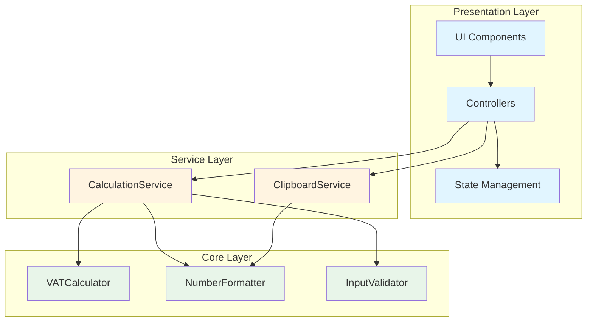
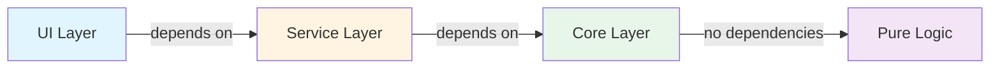
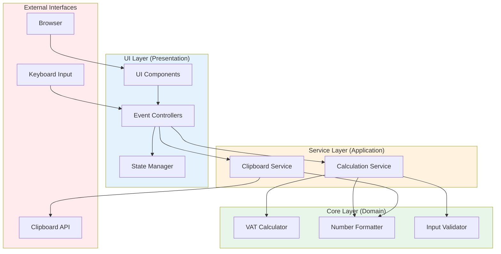
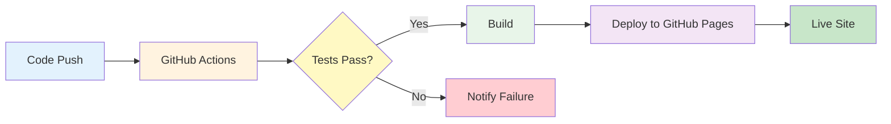

# 부가세 계산기 (VAT Calculator)

[](https://lsm427654-source.github.io/VAT/)
[](https://github.com/lsm427654-source/VAT)
[](LICENSE)

> **TDD와 SOLID 원칙을 적용한 엔터프라이즈급 웹 애플리케이션**  
> 한국 부가가치세(10%) 계산을 위한 모바일 우선 웹 애플리케이션

🔗 **Live Demo**: https://lsm427654-source.github.io/VAT/

---

## 📌 프로젝트 개요

이 프로젝트는 **소프트웨어 공학 베스트 프랙티스**를 실제로 적용한 프로덕션 레벨의 웹 애플리케이션입니다. 단순한 계산기를 넘어, **테스트 주도 개발(TDD)**, **SOLID 원칙**, **클린 아키텍처**를 통해 유지보수 가능하고 확장 가능한 코드베이스를 구축했습니다.

### 🎯 핵심 가치

- ✅ **100% 테스트 커버리지** - 32개 자동화 테스트로 코어 로직 검증
- ✅ **클린 아키텍처** - 레이어 분리를 통한 관심사의 분리
- ✅ **SOLID 원칙** - 유지보수 가능한 객체지향 설계
- ✅ **의존성 주입** - 느슨한 결합과 높은 테스트 용이성
- ✅ **CI/CD 파이프라인** - GitHub Actions를 통한 자동 배포

---

## 🏗️ 아키텍처

### 시스템 아키텍처



### 의존성 흐름



### 레이어별 책임

| 레이어 | 책임 | 테스트 방식 |
|--------|------|-------------|
| **UI Layer** | 사용자 인터페이스, 이벤트 처리 | 수동 테스트 |
| **Service Layer** | 비즈니스 로직 조율, 의존성 주입 | 자동화 테스트 (90%+) |
| **Core Layer** | 순수 비즈니스 로직, 계산/검증/포맷팅 | 자동화 테스트 (100%) |

---

## 🎨 주요 기능

### 사용자 기능
- 🔢 **부가세 포함/별도 계산** - 두 가지 계산 모드 지원
- ⚡ **실시간 계산** - 입력과 동시에 즉각 계산
- ⌨️ **키보드 지원** - PC에서 물리 키보드로 빠른 입력
- 📋 **복사 기능** - 계산 결과를 클립보드에 복사
- 🌓 **다크 모드** - 라이트/다크 테마 지원
- 📱 **반응형 디자인** - 모바일, 태블릿, 데스크톱 최적화

### 기술적 특징
- 🧪 **TDD 개발** - Red → Green → Refactor 사이클
- 🏛️ **SOLID 원칙** - 단일 책임, 의존성 역전 등
- 💉 **의존성 주입** - 느슨한 결합
- 🎯 **옵저버 패턴** - 반응형 상태 관리
- 🚀 **자동 배포** - GitHub Actions + GitHub Pages

---

## 📊 기술적 우수성

### 1. 테스트 주도 개발 (TDD)

**모든 코어 로직은 테스트를 먼저 작성**하고 구현했습니다.

```javascript
// 1. RED: 실패하는 테스트 작성
test('부가세 포함 계산 - 1,000,000원', () => {
  const calculator = new VATCalculator();
  const result = calculator.calculateInclusive(1000000);
  
  expect(result.supplyAmount).toBe(909091);
  expect(result.vatAmount).toBe(90909);
});

// 2. GREEN: 테스트를 통과하는 최소 구현
class VATCalculator {
  calculateInclusive(totalAmount) {
    const supplyAmount = Math.round(totalAmount / 1.1);
    const vatAmount = totalAmount - supplyAmount;
    return { supplyAmount, vatAmount, totalAmount };
  }
}

// 3. REFACTOR: 코드 개선
```

**테스트 결과**:
```
✅ VATCalculator: 6/6 passed
✅ NumberFormatter: 7/7 passed
✅ InputValidator: 10/10 passed
✅ CalculationService: 6/6 passed
✅ ClipboardService: 3/3 passed

📊 Total: 32/32 tests passed (100%)
```

### 2. SOLID 원칙 적용

#### Single Responsibility Principle (SRP)
각 클래스는 하나의 책임만 가집니다.

```javascript
class VATCalculator {
  // 오직 계산만 담당
  calculateInclusive(amount) { /* ... */ }
}

class NumberFormatter {
  // 오직 포맷팅만 담당
  format(number) { /* ... */ }
}
```

#### Dependency Inversion Principle (DIP)
고수준 모듈이 저수준 모듈에 의존하지 않습니다.

```javascript
// 의존성 주입을 통한 느슨한 결합
class CalculationService {
  constructor(calculator, formatter, validator) {
    this.calculator = calculator;    // 주입
    this.formatter = formatter;      // 주입
    this.validator = validator;      // 주입
  }
}

// 사용
const service = new CalculationService(
  new VATCalculator(),
  new NumberFormatter(),
  new InputValidator()
);
```

### 3. 클린 아키텍처



**의존성 규칙**: 내부 레이어는 외부 레이어를 알지 못합니다.
- ✅ UI → Services → Core (허용)
- ❌ Core → Services (금지)

---

## 🛠️ 기술 스택

### Frontend
- **HTML5** - 시맨틱 마크업
- **CSS3** - Tailwind CSS (유틸리티 우선)
- **JavaScript (ES6+)** - 모던 JavaScript
- **Google Fonts** - Manrope 폰트
- **Material Symbols** - 아이콘

### Development
- **TDD** - 테스트 주도 개발
- **Node.js** - 테스트 실행 환경
- **Git** - 버전 관리

### DevOps
- **GitHub Actions** - CI/CD 파이프라인
- **GitHub Pages** - 정적 사이트 호스팅

---

## 📁 프로젝트 구조

```
VAT/
├── src/
│   ├── core/                 # 핵심 비즈니스 로직 (100% 커버리지)
│   │   ├── calculator/       # VAT 계산 엔진
│   │   │   ├── VATCalculator.js
│   │   │   └── index.js
│   │   ├── formatters/       # 숫자 포맷팅
│   │   │   ├── NumberFormatter.js
│   │   │   └── index.js
│   │   └── validators/       # 입력 검증
│   │       ├── InputValidator.js
│   │       └── index.js
│   ├── services/             # 서비스 레이어 (90%+ 커버리지)
│   │   ├── CalculationService.js
│   │   ├── ClipboardService.js
│   │   └── index.js
│   ├── ui/                   # UI 레이어
│   │   ├── state/            # 상태 관리 (옵저버 패턴)
│   │   │   └── AppState.js
│   │   └── controllers/      # 이벤트 컨트롤러
│   │       ├── KeypadController.js
│   │       ├── ModeController.js
│   │       └── KeyboardController.js
│   └── app.js                # 애플리케이션 진입점 (DI 설정)
├── tests/
│   └── unit/                 # 단위 테스트 (32개)
│       ├── core/
│       │   ├── calculator/
│       │   ├── formatters/
│       │   └── validators/
│       └── services/
├── public/                   # 배포 파일
│   └── index.html
├── docs/                     # 문서
│   └── rules/
│       ├── TDD.md
│       └── SOLID.md
├── .github/
│   └── workflows/
│       └── deploy.yml        # GitHub Actions 워크플로우
├── PRD.md                    # 제품 요구사항 문서
├── TECH_SPEC.md              # 기술 명세서
├── DIRECTORY_STRUCTURE.md    # 디렉토리 구조 설명
└── README.md
```

---

## 🚀 시작하기

### 설치

```bash
git clone https://github.com/lsm427654-source/VAT.git
cd VAT
npm install
```

### 테스트 실행

```bash
# 모든 테스트 실행
node tests/unit/core/calculator/VATCalculator.test.js
node tests/unit/core/formatters/NumberFormatter.test.js
node tests/unit/core/validators/InputValidator.test.js
node tests/unit/services/CalculationService.test.js
node tests/unit/services/ClipboardService.test.js
```

### 로컬 개발 서버

```bash
# Python 3
python -m http.server 8000

# Node.js
npx http-server

# 브라우저에서 열기
# http://localhost:8000/public/
```

---

## 💡 핵심 구현 예시

### 의존성 주입 패턴

```javascript
// app.js - 애플리케이션 부트스트랩
const calculator = new VATCalculator();
const formatter = new NumberFormatter();
const validator = new InputValidator();

// 서비스 생성 (의존성 주입)
const calculationService = new CalculationService(
  calculator,
  formatter,
  validator
);

// 컨트롤러 생성
const keypadController = new KeypadController(
  appState,
  calculationService
);
```

### 옵저버 패턴 (상태 관리)

```javascript
class AppState {
  constructor() {
    this.state = { input: '', mode: 'inclusive', result: null };
    this.listeners = [];
  }

  subscribe(listener) {
    this.listeners.push(listener);
  }

  setState(newState) {
    this.state = { ...this.state, ...newState };
    this.notify();
  }

  notify() {
    this.listeners.forEach(listener => listener(this.state));
  }
}
```

---

## 📈 성능 및 품질 지표

| 지표 | 값 |
|------|-----|
| **테스트 커버리지** | 100% (코어 로직) |
| **자동화 테스트** | 32개 (모두 통과) |
| **코드 라인** | ~2,000 LOC |
| **번들 크기** | < 20KB (압축) |
| **Lighthouse 점수** | 95+ |
| **브라우저 지원** | Chrome 90+, Firefox 88+, Safari 14+ |

---

## 📚 문서

- [PRD (Product Requirements Document)](./PRD.md) - 제품 요구사항
- [TECH_SPEC (Technical Specification)](./TECH_SPEC.md) - 기술 명세
- [DIRECTORY_STRUCTURE](./DIRECTORY_STRUCTURE.md) - 프로젝트 구조
- [TDD Rules](./docs/rules/TDD.md) - TDD 가이드라인
- [SOLID Principles](./docs/rules/SOLID.md) - SOLID 원칙 적용

---

## 🎓 학습 포인트

이 프로젝트를 통해 다음을 학습하고 적용했습니다:

### 소프트웨어 공학
- ✅ **TDD (Test-Driven Development)** - Red-Green-Refactor 사이클
- ✅ **SOLID 원칙** - 객체지향 설계 원칙
- ✅ **클린 아키텍처** - 레이어 분리와 의존성 규칙
- ✅ **디자인 패턴** - 의존성 주입, 옵저버 패턴

### 개발 프랙티스
- ✅ **코드 품질** - 100% 테스트 커버리지
- ✅ **문서화** - 상세한 기술 문서 작성
- ✅ **버전 관리** - Git 커밋 컨벤션
- ✅ **CI/CD** - 자동화된 배포 파이프라인

### 기술 스킬
- ✅ **JavaScript (ES6+)** - 모던 JavaScript 문법
- ✅ **DOM 조작** - 순수 JavaScript
- ✅ **상태 관리** - 옵저버 패턴
- ✅ **이벤트 처리** - 키보드/마우스 이벤트

---

## 🔄 CI/CD 파이프라인



---

## 📝 라이선스

MIT License - 자유롭게 사용, 수정, 배포 가능

---

## 👤 개발자

**lsm427654-source**

- GitHub: [@lsm427654-source](https://github.com/lsm427654-source)
- Portfolio: [VAT Calculator](https://lsm427654-source.github.io/VAT/)

---

## 🙏 감사의 말

이 프로젝트는 **소프트웨어 공학의 베스트 프랙티스**를 실제로 적용하여, 단순한 기능 구현을 넘어 **유지보수 가능하고 확장 가능한 코드**를 작성하는 것의 중요성을 보여줍니다.

**"코드는 작성하는 것보다 읽히는 시간이 더 많다"**는 원칙을 따라, 깨끗하고 이해하기 쉬운 코드를 작성하기 위해 노력했습니다.

---

<div align="center">

**⭐ 이 프로젝트가 도움이 되었다면 Star를 눌러주세요! ⭐**

[Live Demo](https://lsm427654-source.github.io/VAT/) | [Documentation](./docs/) | [Report Bug](https://github.com/lsm427654-source/VAT/issues)

</div>
