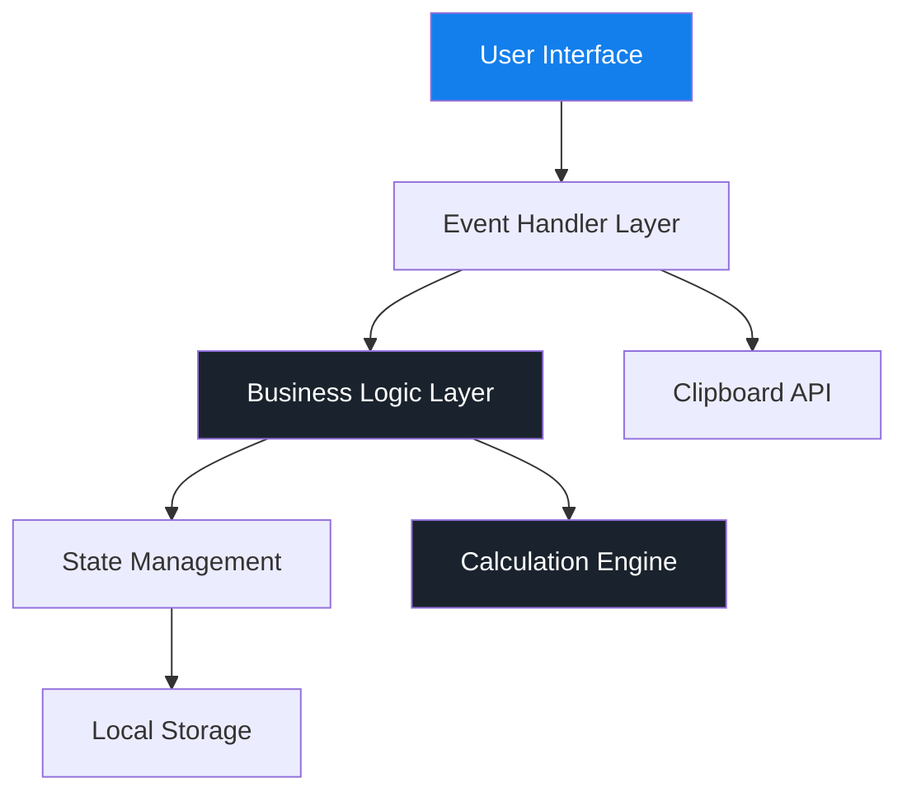

# 부가세 계산기 - Tech Spec (Technical Specification)

**버전**: 1.0  
**작성일**: 2025-12-24  
**프로젝트**: VAT Calculator  
**저장소**: https://github.com/lsm427654-source/VAT.git

---

## 1. 개요

### 1.1 목적
본 문서는 부가세 계산기 웹 애플리케이션의 기술적 구현 방법을 정의합니다. 아키텍처, 기술 스택, 데이터 구조, API 설계, 그리고 구현 세부사항을 포함합니다.

### 1.2 범위
- **MVP (Phase 1)**: 핵심 계산 기능, 키보드 지원, 복사 기능, 다크 모드
- **Phase 2**: 히스토리 기능, 설정 페이지
- **Phase 3**: PWA 변환, 성능 최적화

### 1.3 참조 문서
- [PRD (Product Requirements Document)](./PRD.md)
- [README](./README.md)

---

## 2. 시스템 아키텍처

### 2.1 아키텍처 개요



### 2.2 레이어 구조

#### 2.2.1 Presentation Layer (UI)
- **역할**: 사용자 인터페이스 렌더링
- **기술**: HTML5, Tailwind CSS
- **컴포넌트**:
  - Header (앱 바, 설정/히스토리 버튼)
  - Mode Toggle (세그먼트 컨트롤)
  - Input Display (금액 표시)
  - Result Card (계산 결과)
  - Numeric Keypad (숫자 입력)
  - Toast Notification (피드백)

#### 2.2.2 Event Handler Layer
- **역할**: 사용자 입력 처리 및 이벤트 관리
- **기술**: Vanilla JavaScript (Event Listeners)
- **처리 이벤트**:
  - 클릭 이벤트 (버튼, 모드 전환)
  - 키보드 이벤트 (물리 키보드 입력)
  - 복사 이벤트 (Clipboard API)

#### 2.2.3 Business Logic Layer
- **역할**: 비즈니스 로직 및 계산 처리
- **기술**: Vanilla JavaScript
- **주요 기능**:
  - VAT 계산 로직
  - 입력 검증
  - 숫자 포맷팅
  - 상태 업데이트

#### 2.2.4 State Management
- **역할**: 애플리케이션 상태 관리
- **기술**: JavaScript 변수 (단순 상태 관리)
- **상태 데이터**:
  - `currentInput`: 현재 입력값
  - `currentMode`: 계산 모드 ('inclusive' | 'exclusive')
  - `isDarkMode`: 다크 모드 여부 (Phase 2)
  - `history`: 계산 히스토리 배열 (Phase 2)

#### 2.2.5 Data Persistence Layer
- **역할**: 데이터 저장 및 로드
- **기술**: Web Storage API (localStorage)
- **저장 데이터** (Phase 2):
  - 사용자 설정
  - 계산 히스토리

---

## 3. 기술 스택

### 3.1 프론트엔드

| 카테고리 | 기술 | 버전 | 용도 |
|---------|------|------|------|
| **마크업** | HTML5 | - | 구조 정의 |
| **스타일링** | Tailwind CSS | 3.x (CDN) | UI 스타일링 |
| **스크립팅** | Vanilla JavaScript | ES6+ | 로직 구현 |
| **폰트** | Google Fonts (Manrope) | - | 타이포그래피 |
| **아이콘** | Material Symbols | Outlined | UI 아이콘 |

### 3.2 개발 도구

| 도구 | 용도 |
|------|------|
| **Git** | 버전 관리 |
| **GitHub** | 코드 호스팅 |
| **VS Code** | 코드 에디터 |
| **Chrome DevTools** | 디버깅 및 테스트 |

### 3.3 배포 (Phase 3)

| 서비스 | 용도 |
|--------|------|
| **GitHub Pages** | 정적 사이트 호스팅 |
| **Cloudflare Pages** | 대안 호스팅 (선택사항) |

### 3.4 기술 선택 근거

#### 3.4.1 Vanilla JavaScript
- **장점**:
  - 빌드 도구 불필요 (빠른 개발)
  - 번들 크기 최소화 (성능 최적화)
  - 학습 곡선 낮음
  - 단순한 앱에 적합
- **단점**:
  - 복잡한 상태 관리 어려움 (현재 앱에는 해당 없음)

#### 3.4.2 Tailwind CSS (CDN)
- **장점**:
  - 빠른 프로토타이핑
  - 일관된 디자인 시스템
  - 반응형 디자인 간편
  - 다크 모드 내장 지원
- **단점**:
  - CDN 사용 시 번들 크기 큼 (Phase 3에서 최적화)

---

## 4. 데이터 구조

### 4.1 상태 객체

```javascript
// Application State
const state = {
  currentInput: '0',           // 현재 입력값 (문자열)
  currentMode: 'inclusive',    // 'inclusive' | 'exclusive'
  vatRate: 0.1,                // 부가세율 (10%)
  maxDigits: 12,               // 최대 입력 자릿수
  
  // Phase 2
  settings: {
    darkMode: 'auto',          // 'auto' | 'light' | 'dark'
    vatRate: 0.1,              // 커스텀 세율
    roundingMode: 'round',     // 'round' | 'ceil' | 'floor'
    defaultMode: 'inclusive'   // 기본 계산 모드
  },
  
  history: []                  // 계산 히스토리 배열
};
```

### 4.2 계산 결과 객체

```javascript
// Calculation Result
interface CalculationResult {
  inputAmount: number;    // 입력 금액
  supplyAmount: number;   // 공급가액
  vatAmount: number;      // 부가세
  totalAmount: number;    // 합계금액
  mode: string;           // 'inclusive' | 'exclusive'
  timestamp: number;      // 계산 시간 (Unix timestamp)
}
```

### 4.3 히스토리 항목 (Phase 2)

```javascript
// History Item
interface HistoryItem {
  id: string;             // 고유 ID (UUID)
  result: CalculationResult;
  createdAt: number;      // 생성 시간
}
```

### 4.4 LocalStorage 스키마 (Phase 2)

```javascript
// LocalStorage Keys
const STORAGE_KEYS = {
  SETTINGS: 'vat_calculator_settings',
  HISTORY: 'vat_calculator_history',
  THEME: 'vat_calculator_theme'
};

// Storage Structure
localStorage.setItem(STORAGE_KEYS.SETTINGS, JSON.stringify({
  vatRate: 0.1,
  roundingMode: 'round',
  defaultMode: 'inclusive'
}));

localStorage.setItem(STORAGE_KEYS.HISTORY, JSON.stringify([
  {
    id: 'uuid-1',
    result: { /* CalculationResult */ },
    createdAt: 1703404800000
  }
]));
```

---

## 5. 핵심 알고리즘

### 5.1 VAT 계산 로직

#### 5.1.1 부가세 포함 (역산)

```javascript
/**
 * 부가세 포함 금액에서 공급가액과 부가세를 계산
 * @param {number} totalAmount - 총 금액 (부가세 포함)
 * @param {number} vatRate - 부가세율 (기본 0.1)
 * @returns {Object} { supplyAmount, vatAmount, totalAmount }
 */
function calculateInclusive(totalAmount, vatRate = 0.1) {
  const supplyAmount = Math.round(totalAmount / (1 + vatRate));
  const vatAmount = totalAmount - supplyAmount;
  
  return {
    supplyAmount,
    vatAmount,
    totalAmount
  };
}

// 예시: 1,000,000원 (부가세 포함)
// 공급가액 = 1,000,000 / 1.1 = 909,091원
// 부가세 = 1,000,000 - 909,091 = 90,909원
```

#### 5.1.2 부가세 별도

```javascript
/**
 * 공급가액에서 부가세와 총 금액을 계산
 * @param {number} supplyAmount - 공급가액 (부가세 미포함)
 * @param {number} vatRate - 부가세율 (기본 0.1)
 * @returns {Object} { supplyAmount, vatAmount, totalAmount }
 */
function calculateExclusive(supplyAmount, vatRate = 0.1) {
  const vatAmount = Math.round(supplyAmount * vatRate);
  const totalAmount = supplyAmount + vatAmount;
  
  return {
    supplyAmount,
    vatAmount,
    totalAmount
  };
}

// 예시: 5,000,000원 (공급가액)
// 부가세 = 5,000,000 × 0.1 = 500,000원
// 합계 = 5,000,000 + 500,000 = 5,500,000원
```

### 5.2 숫자 포맷팅

```javascript
/**
 * 숫자를 천 단위 콤마로 포맷팅
 * @param {number} num - 포맷팅할 숫자
 * @returns {string} 포맷팅된 문자열
 */
function formatNumber(num) {
  return Math.round(num).toLocaleString('ko-KR');
}

// 예시: 1000000 → "1,000,000"
```

### 5.3 입력 검증

```javascript
/**
 * 입력값 검증 및 제한
 * @param {string} currentInput - 현재 입력값
 * @param {string} newDigit - 새로 입력된 숫자
 * @param {number} maxDigits - 최대 자릿수
 * @returns {string} 검증된 입력값
 */
function validateInput(currentInput, newDigit, maxDigits = 12) {
  // 선행 0 제거
  if (currentInput === '0') {
    return newDigit;
  }
  
  // 최대 자릿수 체크
  const newInput = currentInput + newDigit;
  if (newInput.length > maxDigits) {
    return currentInput; // 변경 없음
  }
  
  return newInput;
}
```

---

## 6. API 및 브라우저 API

### 6.1 Clipboard API

```javascript
/**
 * 계산 결과를 클립보드에 복사
 * @param {Object} result - 계산 결과 객체
 */
async function copyToClipboard(result) {
  const { inputAmount, supplyAmount, vatAmount, totalAmount, mode } = result;
  const modeText = mode === 'inclusive' ? '부가세 포함' : '부가세 별도';
  
  const text = `[${modeText}]
입력 금액: ${formatNumber(inputAmount)}원
공급가액: ${formatNumber(supplyAmount)}원
부가세(10%): ${formatNumber(vatAmount)}원
합계금액: ${formatNumber(totalAmount)}원`;

  try {
    await navigator.clipboard.writeText(text);
    showToast('복사되었습니다');
  } catch (err) {
    console.error('복사 실패:', err);
    showToast('복사에 실패했습니다');
  }
}
```

### 6.2 Web Storage API (Phase 2)

```javascript
/**
 * 히스토리 저장
 * @param {Array} history - 히스토리 배열
 */
function saveHistory(history) {
  try {
    const json = JSON.stringify(history);
    localStorage.setItem(STORAGE_KEYS.HISTORY, json);
  } catch (err) {
    console.error('저장 실패:', err);
  }
}

/**
 * 히스토리 로드
 * @returns {Array} 히스토리 배열
 */
function loadHistory() {
  try {
    const json = localStorage.getItem(STORAGE_KEYS.HISTORY);
    return json ? JSON.parse(json) : [];
  } catch (err) {
    console.error('로드 실패:', err);
    return [];
  }
}
```

### 6.3 matchMedia API (다크 모드)

```javascript
/**
 * 시스템 다크 모드 감지
 */
function detectDarkMode() {
  const darkModeQuery = window.matchMedia('(prefers-color-scheme: dark)');
  
  // 초기 설정
  updateTheme(darkModeQuery.matches);
  
  // 변경 감지
  darkModeQuery.addEventListener('change', (e) => {
    updateTheme(e.matches);
  });
}

function updateTheme(isDark) {
  if (isDark) {
    document.documentElement.classList.add('dark');
  } else {
    document.documentElement.classList.remove('dark');
  }
}
```

---

## 7. 이벤트 처리

### 7.1 이벤트 맵

| 이벤트 소스 | 이벤트 타입 | 핸들러 함수 | 동작 |
|------------|------------|-----------|------|
| 숫자 버튼 | `click` | `handleNumberInput` | 숫자 입력 |
| 백스페이스 버튼 | `click` | `handleBackspace` | 마지막 자릿수 삭제 |
| 초기화 버튼 | `click` | `handleReset` | 입력값 초기화 |
| 복사 버튼 | `click` | `handleCopy` | 결과 복사 |
| 모드 토글 | `change` | `handleModeChange` | 계산 모드 전환 |
| 키보드 | `keydown` | `handleKeyboard` | 물리 키보드 입력 |

### 7.2 키보드 이벤트 매핑

```javascript
const KEYBOARD_MAP = {
  // 숫자 입력
  '0': () => inputNumber('0'),
  '1': () => inputNumber('1'),
  '2': () => inputNumber('2'),
  '3': () => inputNumber('3'),
  '4': () => inputNumber('4'),
  '5': () => inputNumber('5'),
  '6': () => inputNumber('6'),
  '7': () => inputNumber('7'),
  '8': () => inputNumber('8'),
  '9': () => inputNumber('9'),
  
  // 기능 키
  'Backspace': handleBackspace,
  'Delete': handleBackspace,
  'Enter': handleCopy,
  'Escape': handleReset,
  'Tab': handleModeToggle
};

document.addEventListener('keydown', (e) => {
  const handler = KEYBOARD_MAP[e.key];
  if (handler) {
    e.preventDefault();
    handler();
    animateButton(e.key); // 시각적 피드백
  }
});
```

---

## 8. UI 컴포넌트 명세

### 8.1 컴포넌트 계층 구조

```
App
├── Header
│   ├── Title
│   └── Actions
│       ├── SettingsButton
│       └── HistoryButton
├── Main
│   ├── ModeToggle
│   │   ├── InclusiveOption
│   │   └── ExclusiveOption
│   ├── InputDisplay
│   ├── ResultCard
│   │   ├── SupplyAmountRow
│   │   ├── VatAmountRow
│   │   ├── Divider
│   │   ├── TotalAmountRow
│   │   └── ActionButtons
│   │       ├── ResetButton
│   │       └── CopyButton
│   └── NumericKeypad
│       ├── NumberButtons (0-9, 00)
│       └── BackspaceButton
└── Toast
```

### 8.2 컴포넌트 상세

#### 8.2.1 NumericKeypad

```javascript
// Keypad Configuration
const KEYPAD_LAYOUT = [
  ['7', '8', '9'],
  ['4', '5', '6'],
  ['1', '2', '3'],
  ['00', '0', 'backspace']
];

// Render Function
function renderKeypad() {
  const keypadHTML = KEYPAD_LAYOUT.map(row => 
    row.map(key => {
      if (key === 'backspace') {
        return `<button class="keypad-btn-special" data-action="backspace">
          <span class="material-symbols-outlined">backspace</span>
        </button>`;
      }
      return `<button class="keypad-btn" data-value="${key}">${key}</button>`;
    }).join('')
  ).join('');
  
  return `<div class="keypad-grid">${keypadHTML}</div>`;
}
```

#### 8.2.2 ResultCard

```javascript
// Result Display
function updateResultDisplay(result) {
  const { supplyAmount, vatAmount, totalAmount } = result;
  
  document.getElementById('supplyAmount').textContent = 
    `${formatNumber(supplyAmount)}원`;
  document.getElementById('vatAmount').textContent = 
    `${formatNumber(vatAmount)}원`;
  document.getElementById('totalAmount').textContent = 
    `${formatNumber(totalAmount)}원`;
}
```

---

## 9. 스타일링 시스템

### 9.1 Tailwind 설정

```javascript
tailwind.config = {
  darkMode: 'class',
  theme: {
    extend: {
      colors: {
        primary: '#137fec',
        'background-light': '#f6f7f8',
        'background-dark': '#101922',
        'surface-dark': '#1a232d',
        'surface-light': '#ffffff',
      },
      fontFamily: {
        display: ['Manrope', 'sans-serif']
      },
      borderRadius: {
        DEFAULT: '0.25rem',
        lg: '0.5rem',
        xl: '0.75rem',
        '2xl': '1rem',
        full: '9999px'
      }
    }
  }
};
```

### 9.2 커스텀 CSS

```css
/* Button Press Animation */
.btn-press:active {
  transform: scale(0.96);
  transition: transform 0.1s;
}

/* Keyboard Press Animation */
.keyboard-press {
  animation: keyPress 0.15s ease-out;
}

@keyframes keyPress {
  0% { transform: scale(1); }
  50% { transform: scale(0.96); }
  100% { transform: scale(1); }
}

/* Scrollbar Hide */
.no-scrollbar::-webkit-scrollbar {
  display: none;
}
.no-scrollbar {
  -ms-overflow-style: none;
  scrollbar-width: none;
}
```

---

## 10. 성능 최적화

### 10.1 초기 로딩 최적화

| 전략 | 구현 방법 |
|------|----------|
| **리소스 최소화** | 단일 HTML 파일, CDN 사용 |
| **폰트 최적화** | `display=swap` 사용 |
| **이미지 최적화** | 아이콘은 Material Symbols 사용 (벡터) |
| **지연 로딩** | 필요 없음 (단일 페이지) |

### 10.2 런타임 최적화

```javascript
// Debounce for input (필요시)
function debounce(func, wait) {
  let timeout;
  return function executedFunction(...args) {
    const later = () => {
      clearTimeout(timeout);
      func(...args);
    };
    clearTimeout(timeout);
    timeout = setTimeout(later, wait);
  };
}

// 현재는 즉시 계산이므로 debounce 불필요
// 추후 복잡한 계산 시 사용 가능
```

### 10.3 메모리 관리

```javascript
// 히스토리 크기 제한 (Phase 2)
const MAX_HISTORY_SIZE = 20;

function addToHistory(item) {
  state.history.unshift(item);
  
  // 최대 크기 초과 시 오래된 항목 제거
  if (state.history.length > MAX_HISTORY_SIZE) {
    state.history = state.history.slice(0, MAX_HISTORY_SIZE);
  }
  
  saveHistory(state.history);
}
```

---

## 11. 에러 처리

### 11.1 에러 타입

| 에러 타입 | 발생 상황 | 처리 방법 |
|----------|----------|----------|
| **입력 오류** | 최대 자릿수 초과 | 입력 무시, 시각적 피드백 없음 |
| **계산 오류** | NaN, Infinity | 0으로 처리 |
| **복사 실패** | Clipboard API 미지원 | 토스트로 에러 메시지 표시 |
| **저장 실패** | localStorage 용량 초과 | 콘솔 로그, 기능 계속 작동 |

### 11.2 에러 핸들링 예시

```javascript
// Safe Calculation
function safeCalculate(input, mode) {
  try {
    const value = parseInt(input) || 0;
    
    if (!isFinite(value) || value < 0) {
      return getDefaultResult();
    }
    
    return mode === 'inclusive' 
      ? calculateInclusive(value)
      : calculateExclusive(value);
      
  } catch (err) {
    console.error('계산 오류:', err);
    return getDefaultResult();
  }
}

function getDefaultResult() {
  return {
    supplyAmount: 0,
    vatAmount: 0,
    totalAmount: 0
  };
}
```

---

## 12. 테스트 전략

### 12.1 단위 테스트 (Phase 2)

```javascript
// 계산 로직 테스트
describe('VAT Calculation', () => {
  test('부가세 포함 계산', () => {
    const result = calculateInclusive(1000000);
    expect(result.supplyAmount).toBe(909091);
    expect(result.vatAmount).toBe(90909);
    expect(result.totalAmount).toBe(1000000);
  });
  
  test('부가세 별도 계산', () => {
    const result = calculateExclusive(5000000);
    expect(result.supplyAmount).toBe(5000000);
    expect(result.vatAmount).toBe(500000);
    expect(result.totalAmount).toBe(5500000);
  });
});
```

### 12.2 수동 테스트 체크리스트

#### 기능 테스트
- [ ] 숫자 입력 (0-9, 00)
- [ ] 백스페이스 삭제
- [ ] 초기화 기능
- [ ] 모드 전환 (포함 ↔ 별도)
- [ ] 복사 기능
- [ ] 키보드 입력 (0-9, Backspace, Enter, Esc, Tab)

#### UI/UX 테스트
- [ ] 다크 모드 전환
- [ ] 반응형 레이아웃 (모바일, 태블릿, 데스크톱)
- [ ] 버튼 애니메이션
- [ ] 토스트 메시지 표시

#### 브라우저 호환성
- [ ] Chrome
- [ ] Firefox
- [ ] Safari
- [ ] Edge

---

## 13. 보안 고려사항

### 13.1 XSS 방지

```javascript
// 사용자 입력은 숫자만 허용
function sanitizeInput(input) {
  return input.replace(/[^0-9]/g, '');
}

// textContent 사용 (innerHTML 사용 금지)
element.textContent = userInput; // ✅ Safe
// element.innerHTML = userInput; // ❌ Unsafe
```

### 13.2 데이터 검증

```javascript
// LocalStorage 데이터 검증
function validateStorageData(data) {
  if (!data || typeof data !== 'object') {
    return false;
  }
  
  // 스키마 검증
  const requiredKeys = ['vatRate', 'roundingMode', 'defaultMode'];
  return requiredKeys.every(key => key in data);
}
```

---

## 14. 배포 전략

### 14.1 GitHub Actions + GitHub Pages

#### 워크플로우 설정
프로젝트는 GitHub Actions를 통해 자동으로 빌드 및 배포됩니다.

**파일**: `.github/workflows/deploy.yml`

```yaml
name: Deploy to GitHub Pages

on:
  push:
    branches:
      - main
  workflow_dispatch:

permissions:
  contents: read
  pages: write
  id-token: write

jobs:
  deploy:
    runs-on: ubuntu-latest
    steps:
      - name: Checkout
        uses: actions/checkout@v4
      
      - name: Setup Pages
        uses: actions/configure-pages@v4
      
      - name: Upload artifact
        uses: actions/upload-pages-artifact@v3
        with:
          path: '.'
      
      - name: Deploy to GitHub Pages
        uses: actions/deploy-pages@v4
```

#### 배포 프로세스
1. `main` 브랜치에 푸시
2. GitHub Actions 자동 실행
3. 전체 프로젝트를 Pages 아티팩트로 업로드
4. GitHub Pages에 자동 배포
5. `https://lsm427654-source.github.io/VAT/` 에서 접근 가능

#### GitHub Pages 설정
1. Repository Settings → Pages
2. Source: GitHub Actions 선택
3. 자동 배포 활성화

### 14.2 PWA 변환 (Phase 3)

#### manifest.json
```json
{
  "name": "부가세 계산기",
  "short_name": "VAT Calculator",
  "description": "한국 부가가치세 계산기",
  "start_url": "/",
  "display": "standalone",
  "background_color": "#101922",
  "theme_color": "#137fec",
  "icons": [
    {
      "src": "/icon-192.png",
      "sizes": "192x192",
      "type": "image/png"
    },
    {
      "src": "/icon-512.png",
      "sizes": "512x512",
      "type": "image/png"
    }
  ]
}
```

#### Service Worker
```javascript
// sw.js
const CACHE_NAME = 'vat-calculator-v1';
const urlsToCache = [
  '/',
  '/index.html',
  '/manifest.json'
];

self.addEventListener('install', (event) => {
  event.waitUntil(
    caches.open(CACHE_NAME)
      .then(cache => cache.addAll(urlsToCache))
  );
});
```

---

## 15. 향후 개선 사항

### 15.1 Phase 2 기능

- **히스토리 기능**
  - IndexedDB 사용 (더 큰 저장 용량)
  - 검색 및 필터링
  - 엑셀 내보내기

- **설정 페이지**
  - 세율 커스터마이징 (0-100%)
  - 반올림 방식 선택
  - 언어 설정 (한국어/영어)

### 15.2 Phase 3 최적화

- **성능**
  - Tailwind CSS 최적화 (PurgeCSS)
  - 코드 압축 (Minification)
  - 이미지 최적화

- **기능**
  - 오프라인 지원 (PWA)
  - 다국어 지원 (i18n)
  - 인쇄 기능

---

## 16. 부록

### 16.1 파일 구조

```
VAT/
├── index.html          # 메인 애플리케이션
├── README.md           # 프로젝트 설명
├── PRD.md              # 제품 요구사항 문서
├── TECH_SPEC.md        # 기술 명세서 (본 문서)
├── .gitignore          # Git 제외 파일
│
└── (Phase 3)
    ├── manifest.json   # PWA 매니페스트
    ├── sw.js           # Service Worker
    ├── assets/
    │   ├── icons/      # 앱 아이콘
    │   └── images/     # 이미지 리소스
    └── docs/           # 추가 문서
```

### 16.2 코딩 컨벤션

#### JavaScript
- **네이밍**: camelCase (변수, 함수), UPPER_CASE (상수)
- **들여쓰기**: 2 spaces
- **세미콜론**: 사용
- **문자열**: 작은따옴표 사용

#### CSS/Tailwind
- **클래스 순서**: 레이아웃 → 크기 → 스타일 → 애니메이션
- **커스텀 클래스**: `kebab-case`

#### HTML
- **들여쓰기**: 2 spaces
- **속성 순서**: id → class → data-* → 기타

### 16.3 Git 커밋 컨벤션

```
feat: 새로운 기능 추가
fix: 버그 수정
docs: 문서 수정
style: 코드 포맷팅
refactor: 코드 리팩토링
test: 테스트 추가/수정
chore: 빌드 설정 등
```

---

## 변경 이력

| 버전 | 날짜 | 변경 내용 | 작성자 |
|------|------|-----------|--------|
| 1.0 | 2025-12-24 | 초안 작성 | - |

---

**문의**: 기술 명세에 대한 질문이나 수정 요청은 프로젝트 관리자에게 문의해주세요.
